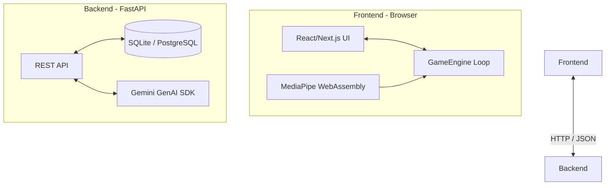

# System Architecture

EyeFit relies on a decoupled architecture, clearly separating the real-time, browser-based inference and game rendering loops from the standard React UI lifecycle, and backing it all with a stateless FastAPI backend.

## High-Level Architecture

## Frontend (Next.js + MediaPipe)

The frontend is the heavy lifter in this application. It handles webcam stream processing, running TensorFlow Lite models via WebAssembly, and running the physics-based game loop.

### 1. The Game Loop (`GameEngine.ts`)
React state is too slow to handle 60 FPS physics updates. 
Instead, `GameEngine.ts` uses the browser's native `requestAnimationFrame` API to run a decoupled physics loop. It manages the bird's velocity, obstacle collision, and score entirely outside of React's Virtual DOM. 

It exposes an `onStateChange` callback to safely synchronize its internal state (like score or Game Over events) back to React for the UI to display.

### 2. Computer Vision (`PoseTracker` & `GazeAnalyzer`)
We use Google's MediaPipe Tasks API. 
- **FaceLandmarker**: Detects 478 3D facial landmarks. We extract the eye and iris coordinates to determine where the user is looking.
- **PoseLandmarker**: Detects 33 skeletal landmarks. We extract the shoulders, elbows, and wrists.

**Performance Optimization**: Passing these raw landmarks into React state 60 times a second would crash the browser. We wrap these trackers in custom React hooks (`usePose` and `useGaze`) that throttle the React state updates to 30 FPS, while the GameEngine still runs at a buttery smooth 60 FPS.

## Backend (FastAPI)

The backend is built with FastAPI. It provides standard RESTful endpoints for user authentication, session persistence, and gamification logic.

### 1. Database (SQLAlchemy)
The ORM models (`app/db/models.py`) define:
- `User`: Credentials and identity.
- `UserProgress`: RPG-like stats (XP, level, streak).
- `GameSession`: Individual workout records (Reps, Form Score, Duration).
- `Achievement`: Badges unlocked by the user.

### 2. AI Coach Integration
When the frontend fetches the `/api/coach/{session_id}` endpoint, the backend retrieves the structured data for that game session. It constructs a secure, structured prompt and passes it to the **Google GenAI SDK** (Gemini model). The AI generates tailored, encouraging feedback which is passed back to the client.

## Deployment Strategy

The application is containerized using Docker.
- **Frontend Container**: Builds a Next.js `standalone` bundle, resulting in a tiny, optimized Node.js image that serves the pre-rendered UI and static MediaPipe WASM assets.
- **Backend Container**: Runs the FastAPI server using `uvicorn`.

This allows the entire stack to be deployed easily using Docker Compose to a single VPS or split across managed cloud services (e.g., Vercel for frontend, Render for backend).
